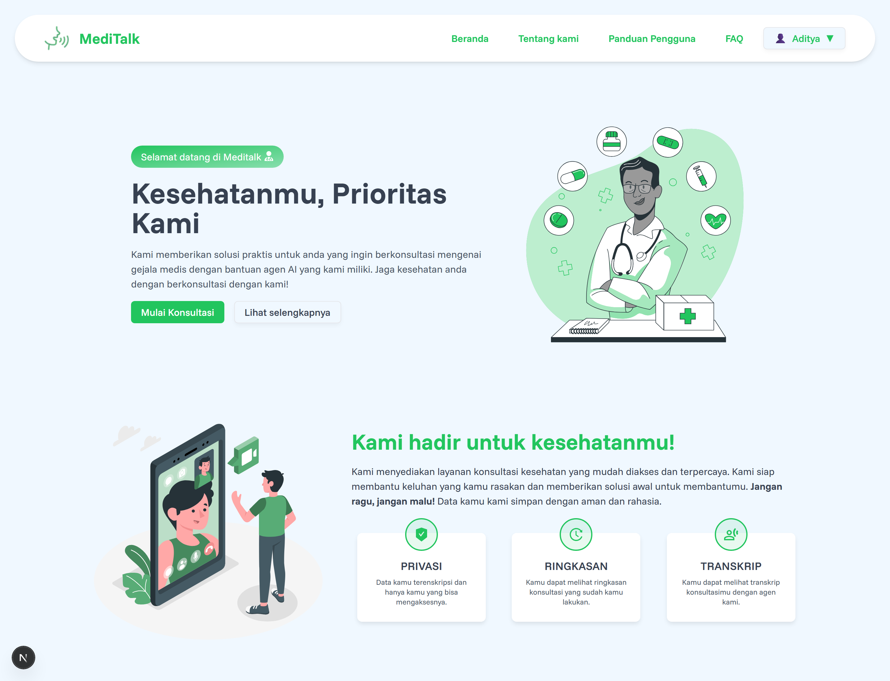

# 🩺 MediTalk — AI Medical Voice Agent

**MediTalk** adalah website yang memunginkan pengguna untuk berkonsultai dengan agen AI tentang gejala medis yang dialami dengan komunikasi real-time berbasis suara.  
Dibangun dengan **Next.js 15**, **Auth.js**, **Prisma**, and **ShadCN UI**.



---

## 🚀 Fitur Utama (Rencana)

| Versi  | Deskripsi                                    |
| ------ | -------------------------------------------- |
| v0.1.0 | Setup project, Auth (Google), Front-End base |
| v0.2.0 | Konsultasi dengan Agen AI (MVP)              |
| v0.3.0 | Multilingual support (EN/ID)                 |
| v1.0.0 | Rilis dan optimasi sistem                    |

---

## Functional Requierement

| Kode  | Kebutuhan Fungsional                | Penjelasan                                                                                                     |
| ----- | ----------------------------------- | -------------------------------------------------------------------------------------------------------------- |
| FR-01 | Melakukan autentikasi               | Sistem memungkinkan pengguna dapat melakukan autentikasi lewat provider google.                                |
| FR-02 | Memasukkan gejala berbasis teks     | Sistem dapat memungkinkan pengguna untuk memasukkan gejala awal dengan input teks.                             |
| FR-03 | Melakukan konsultasi berbasis suara | Sistem memungkinkan pengguna melakukan konsultasi lanjutan dengan AI Agent lewat input suara melalui mikrofon. |
| FR-04 | Menampilkan transkrip konsultasi    | Sistem menampilkan transkrip percakapan konsultasi secara real-time.                                           |
| FR-05 | Menampilkan ringkasan konsultasi    | Sistem menampilkan ringkasan percakapan konsultasi setelah melakukan konsultasi.                               |
| FR-06 | Menyimpan riwayat konsultasi        | Sistem menyimpan riwayat konsultasi untuk dapat dilihat kembali oleh pengguna.                                 |

---

## 🧩 Tech Stack

- **Frontend**: Next.js 15, TailwindCSS, ShadCN UI
- **Backend**: Next.js Route Handlers + Prisma (PostgreSQL via Neon)
- **Auth**: NextAuth (Auth.js) with Google Provider
- **Voice Engine**: VAPI AI dengan model suara dari 11labs
- **Payment**: Stripe/Clerk/etc
- **i18n/multilingual**: next-intl

---

## ⚙️ Langkah instalasi

```bash
git clone https://github.com/adityaridhon/meditalk.git
cd meditalk
npm install
cp .env.example .env.local
npm run dev
```
